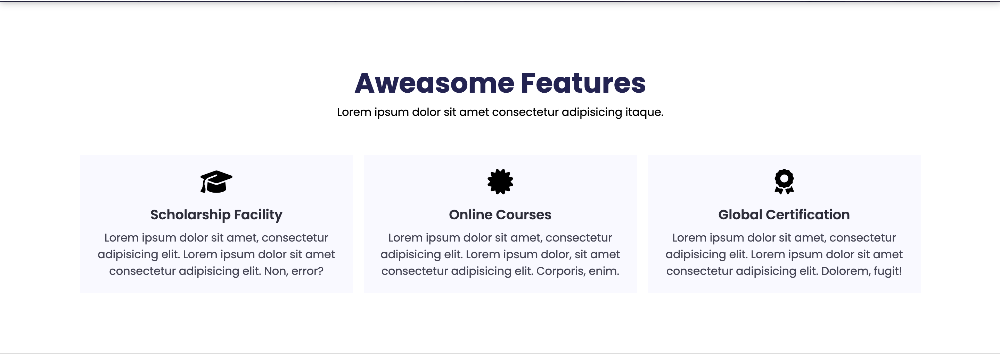
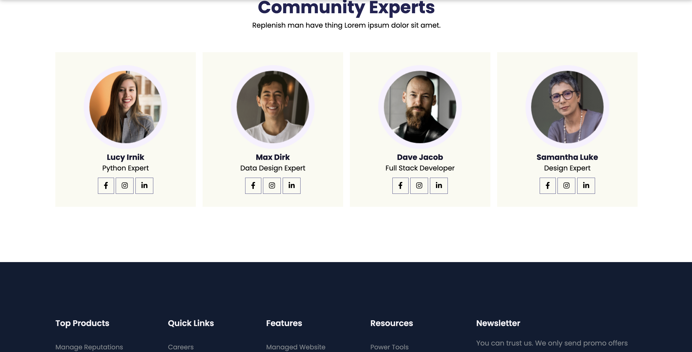
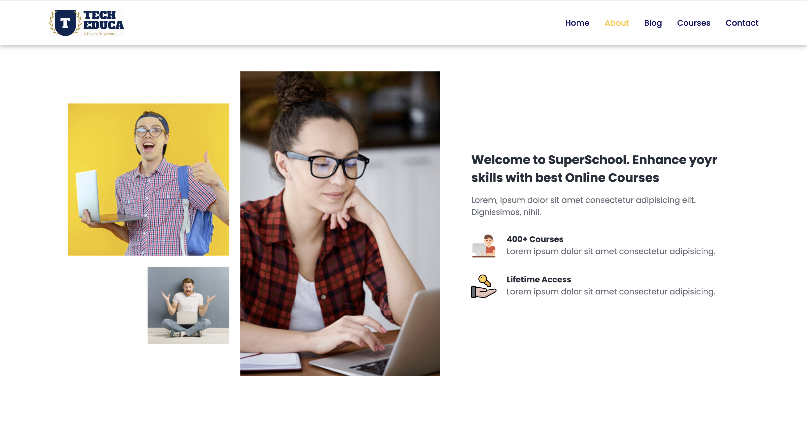
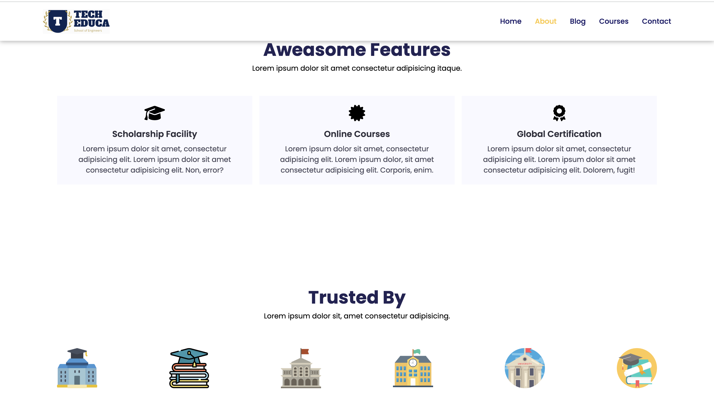

# Tech2 etc Tutorial - Online Learning Platform

[](#)
[](#)
[](#)

A modern, responsive educational website template designed for online learning platforms. This project showcases a clean and professional design with multiple pages for courses, blogs, contact, and more.

## 📋 Table of Contents

- [Screenshots](#screenshots)
- [Features](#-features)
- [Tech Stack](#-tech-stack)
- [Pages](#-pages)
- [Installation](#-installation)
- [Responsive Design](#-responsive-design)

---

## 📸 Screenshots








## ✨ Features

- **Fully Responsive Design** - Works seamlessly on desktop, tablet, and mobile devices
- **Multiple Pages** - Home, About, Blog, Courses, Course Details, and Contact pages
- **Modern UI/UX** - Clean and professional design with smooth transitions
- **Course Catalog** - Showcase multiple courses with pricing and ratings
- **Blog Section** - Share educational content and articles
- **Contact Form** - Allow users to get in touch easily
- **Newsletter Subscription** - Build your mailing list
- **Social Media Integration** - Connect with your audience
- **Mobile Navigation** - Responsive hamburger menu for mobile devices
- **Course Enrollment System** - Detailed course pages with enrollment options

## 🛠️ Tech Stack

- **HTML5** - Semantic markup and structure
- **CSS3** - Modern styling with Flexbox and Grid
- **Google Fonts** - Poppins font family
- **Font Awesome** - Icons and visual elements
- **Responsive Design** - Mobile-first approach with media queries

## 📄 Pages

1. **index.html** - Homepage with hero section, featured courses, and registration
2. **about.html** - About page with company information and trusted partners
3. **blog.html** - Blog listing page with categories
4. **post.html** - Individual blog post page
5. **course.html** - Complete course catalog
6. **course-inner.html** - Detailed course information and enrollment
7. **contact.html** - Contact form and company information
8. **style.css** - Main stylesheet for all pages

## 🚀 Installation

1. Clone or download this repository
```bash
git clone https://github.com/yourusername/tech2-tutorial.git
```

2. Navigate to the project directory
```bash
cd tech2-tutorial
```

3. Open `index.html` in your web browser
```bash
# Or simply double-click on index.html
```

No build process or dependencies required - it's pure HTML and CSS!


## 📱 Responsive Design

The website is fully responsive with breakpoints at:
- **Mobile**: 376px and below
- **Tablet**: 475px to 769px
- **Desktop**: 769px and above

Features include:
- Hamburger menu for mobile navigation
- Flexible grid layouts that adapt to screen size
- Optimized images and content for all devices
- Touch-friendly buttons and links


---

**Made with ❤️ by Asad Naveed**